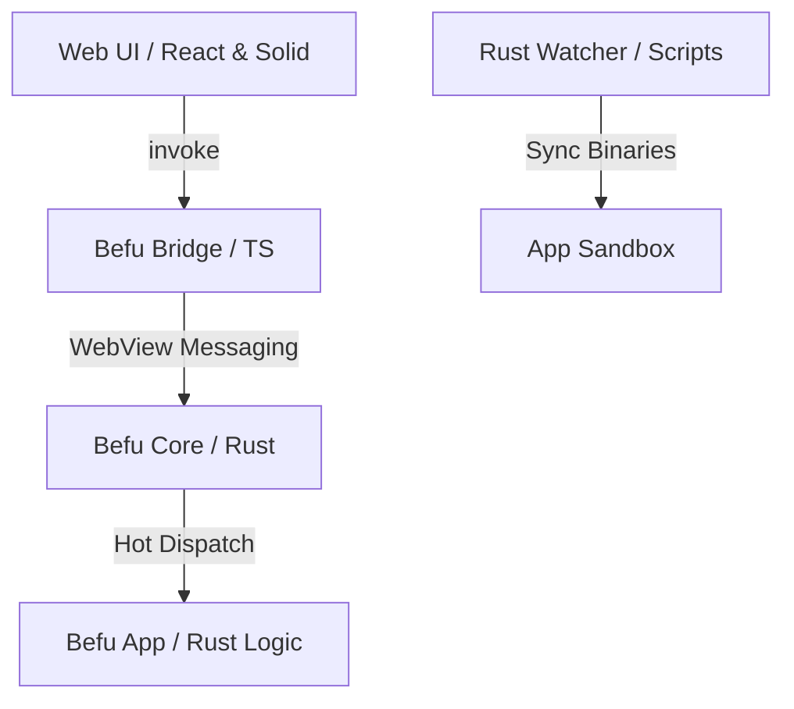

<div align="center">

[](https://github.com/itisrohit/Befu/actions)
[](https://www.npmjs.com/package/create-befu-app)
[](https://opensource.org/licenses/MIT)
[](https://www.rust-lang.org)

**Hot reload Rust backend logic inside mobile apps — no rebuilds, no reinstalls.**

[Getting Started](docs/getting-started.md) • [Architecture](docs/architecture.md) • [Documentation](docs/) • [Roadmap](docs/phases-next.md) • [Contributing](CONTRIBUTING.md)

</div>

---

Befu is a high-performance cross-platform framework for building mobile and web applications using React or SolidJS for the UI and Rust for business logic. It features a custom, low-latency bridge and a dynamic hot-reload system for native code.

## Key Features

- **Zero-Click Hot Reload**: Update native Rust logic on-device in approximately 1 second without full app rebuilds or reinstalls.
- **Framework Agnostic**: Native support for React and SolidJS.
- **Typed Bridge**: High-performance communication layer between WebView and Rust.
- **Modern Scaffolding**: Create complete cross-platform monorepos instantly via `create-befu-app`.
- **Engineering Tools**: Built-in `doctor` and `bootstrap` scripts to automate environment management.

## Demo

Edit a Rust command and save; the application updates instantly without losing internal state.


## Table of Contents

- [Why Befu?](#why-befu)
- [Example Usage](#example-usage)
- [Architecture](#architecture)
- [Quick Start](#quick-start)
- [Scaffold A New App](#scaffold-a-new-app)
- [Contributing](#contributing)
- [License](#license)

## Why Befu?

Traditional mobile development involves significant wait times for Gradle or Xcode builds following every backend or business logic change. Befu eliminates this friction:

- **Save Rust to update the application instantly**.
- **Unified development across platforms**.
- **Persistent mobile app environment during logic swaps**.
- **Native performance with web-like iteration speeds**.

## Example Usage

### Rust Backend

Define high-performance logic using procedural macros:

```rust
#[befu::command]
fn calculate_fast(args: MyArgs) -> MyResult {
    // Rust computation logic
    MyResult { score: 100 }
}
```

### Frontend (React/Solid)

Invoke native code with a typed promise API:

```typescript
import { invoke } from '@befu/bridge'

const result = await invoke('calculate_fast', { id: 1 })
console.log(result.score) // 100
```

## Platform Support & Status

| Feature        | Android           | iOS               | Web           |
| :------------- | :---------------- | :---------------- | :------------ |
| **Bridge UI**  | ✅                | ✅                | ✅            |
| **Hot Reload** | ✅ (Side-loading) | ⚠️ (Bundled Only) | ✅ (Vite HMR) |
| **Production** | 🚧 Beta           | 🚧 Alpha          | ✅ Stable     |

_Note: iOS hot-reloading is currently limited to bundled logic due to App Store dynamic loading restrictions. We are prioritizing Android-first high-frequency DX._

## Security Model

Befu is designed with a strict "Dev vs Prod" boundary. The dynamic library loading required for hot-reloading is gated behind feature flags and is intended to be stripped from production binaries to eliminate remote code execution vectors.

Befu utilizes a dynamic-loading registry to swap logic at the binary boundary.



## Quick Start

### 1. Environment Audit

Verify your system configuration for native Rust and mobile development:

```bash
bun run doctor
```

### 2. Bootstrap

Initialize dependencies and prepare platform-specific assets:

```bash
bun run bootstrap
```

### 3. Launch Development

Start the full development cycle for your target platform:

```bash
bun run a:dev  # Android Development
# OR
bun run i:dev  # iOS Development
```

## Scaffold A New App

Automated project initialization using the official scaffolder:

```bash
bunx create-befu-app --name my-app --framework react --platform both --yes
```

> [!TIP]
> If your local environment cache is stale, pin the latest release: `bunx create-befu-app@0.1.5 [...]`

## Contributing

Contributions from the community are encouraged. Refer to the [Contributing Guide](CONTRIBUTING.md) to begin.

## License

Befu is open-source software licensed under the [MIT License](LICENSE).

---

<p align="center">Made with love ❤️</p>
