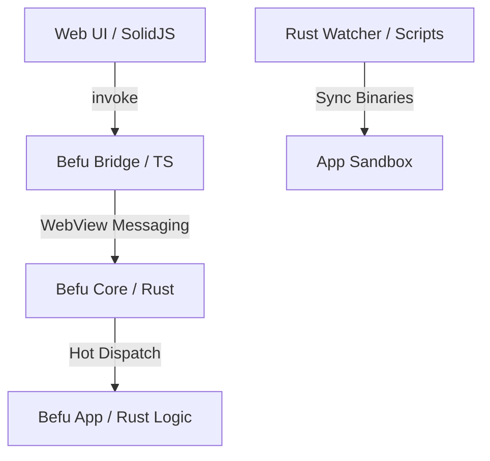

# Befu

Hot reload Rust backend logic inside mobile apps — no rebuilds, no reinstalls.

Edit Rust → save → your app updates instantly (~1s).

## Demo

Edit a Rust command → save → app updates instantly (no rebuild, no reinstall).


## Why Befu?

Traditional mobile development requires rebuilding and reinstalling apps every time you change backend logic.

Befu eliminates that loop:

- **Save Rust → Instant effect** in your app.
- **No rebuilds** (no waiting for Gradle/Xcode).
- **No reinstalls** (keep your app state).
- **No context switching**.

**Install your app once. Iterate forever.**

## Example

**Rust Backend:**

```rust
#[befu::command]
fn hello() -> String {
    "Hello v2".into()
}
```

**Frontend (SolidJS/TS):**

```typescript
const result = await invoke('hello')
```

Change Rust → save → **app updates instantly**.

## Architecture



## Project Status

**Phase 2 Stable**: Procedural macro command registry and dynamic hot-reloading are fully functional.

We are currently looking for builders to help with **Phase 3 (iOS device support)** and **Phase 4 (Android Production Hardening)**.

## Quick Start

### 1. Check Requirements

Befu requires Bun, Rust, and platform-specific tools:

```bash
bun run doctor
```

### 2. Bootstrap Workspace

Install dependencies, git hooks, and prepare platform-specific assets:

```bash
bun run bootstrap
```

### 3. Launch Development

Start the full development cycle in **one command** (includes Web UI, Rust watcher, and app launch):

```bash
bun run a:dev  # Launch everything for Android
# OR
bun run i:dev  # Launch everything for iOS
```

**Zero-Click Hot Reloading:**
Once the watcher is running (manually or via `a:dev`), simply **Save** your Rust code. The app will detect the change and swap the command registry automatically within ~1 second. No reload button required!

## Scaffold A New App

Package: [create-befu-app on npm](https://www.npmjs.com/package/create-befu-app)

```bash
bunx create-befu-app --name my-befu-app --platform both --yes
```

If your local `bunx` cache is stale, pin explicitly:

```bash
bunx create-befu-app@0.1.4 --name my-befu-app --platform both --yes
```

## Docs

- Setup and daily workflows: [`docs/getting-started.md`](docs/getting-started.md)
- Scaffolder usage and troubleshooting: [`docs/scaffolder-cli.md`](docs/scaffolder-cli.md)
- Current roadmap and priorities: [`docs/phases-next.md`](docs/phases-next.md)
- Rust Command DX guide: [`docs/command-dx.md`](docs/command-dx.md)
- Hot Command Reload guide: [`docs/hot-reload.md`](docs/hot-reload.md)

---

Built with love ❤️
