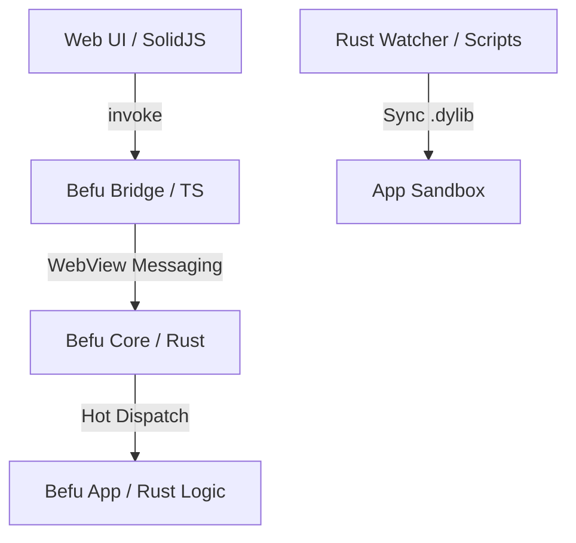

# Befu

Befu is a mobile runtime for building Rust-backed applications. It is dedicated to developer iteration velocity, combining standard Web UIs (SolidJS/Vite) with the raw performance and ecosystem of Rust.

## Hot Rust Command Reload

The core feature of Befu is **Hot Rust Command Reloading** (Debug Only). Sync Rust code changes to your mobile device or simulator in near real-time without full builds or app reinstalls.

## Architecture



## Project Status

**Phase 2 Stable**: Procedural macro command registry and dynamic hot-reloading are fully functional.

We are currently looking for builders to help with **Phase 3 (iOS device support)** and **Phase 4 (Android Production Hardening)**. Help us take Befu from a prototype to a production-ready release.

## Quick Start

### 1. Check Requirements

Befu requires Bun, Rust, and platform-specific tools:

```bash
bun run doctor
```

### 2. Bootstrap Workspace

Install dependencies, git hooks, and prepare platform-specific assets:

```bash
bun run bootstrap
```

### 3. Launch Development

Start the full development cycle in **one command** (includes Web UI, Rust watcher, and app launch):

```bash
bun run a:dev  # Launch everything for Android
# OR
bun run i:dev  # Launch everything for iOS
```

Or start individual components manually if you prefer separate terminal tabs:

```bash
bun run dev    # Just the Web UI server
bun run a:up   # Just launch/install Android
bun run a:hot  # Just the Rust watcher
```

**Hot Reloading:**
Once the watcher is running (manually or via `a:dev`), click the **🔄 Reload Rust** button in the app to apply logic changes instantly.

## Scaffold A New App

Package: [create-befu-app on npm](https://www.npmjs.com/package/create-befu-app)

```bash
bunx create-befu-app --name my-befu-app --platform both --yes
```

If your local `bunx` cache is stale, pin explicitly:

```bash
bunx create-befu-app@0.1.3 --name my-befu-app --platform both --yes
```

## Status

Experimental prototype.

## Docs

- Setup and daily workflows: [`docs/getting-started.md`](docs/getting-started.md)
- Scaffolder usage and troubleshooting: [`docs/scaffolder-cli.md`](docs/scaffolder-cli.md)
- Current roadmap and priorities: [`docs/phases-next.md`](docs/phases-next.md)
- Rust Command DX guide: [`docs/command-dx.md`](docs/command-dx.md)
- Hot Command Reload guide: [`docs/hot-reload.md`](docs/hot-reload.md)

---

Built with love ❤️
